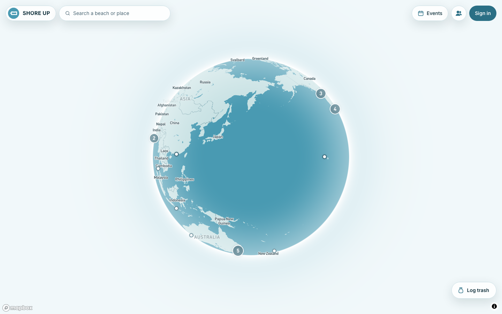
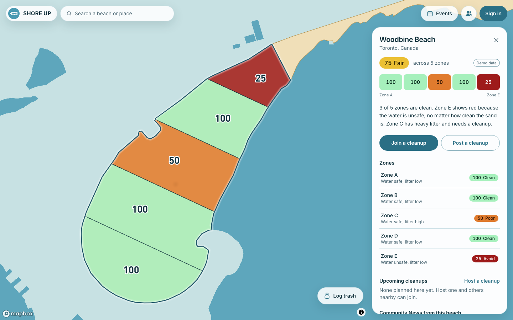

<div align="center">


# Shore Up

**See how clean a beach is, zone by zone, and who is already helping it.**

[Live demo](https://shore-up-danielchahine0-stripe.vercel.app) · [Decisions log](DECISIONS.md) · [Contributing](CONTRIBUTING.md)

[](LICENSE)


</div>

Shore Up opens on a 3D globe, flies into a beach, and shows its zones on a green-to-red cleanliness scale.
Volunteers post cleanups, and every post shows up on the map, in their community, and on their profile.
It was built in a one-day hackathon on 2026-09-19.

| Globe | Beach zones |
| --- | --- |
|  |  |

## Features

- **3D globe and search.**
  469 beaches and 3,092 zones, with shapes from OpenStreetMap.
- **Zone scores.**
  Each zone gets a 0 to 100 score from water quality and litter, and unsafe water always shows red.
- **Real water quality.**
  440 zones carry official readings from the City of Toronto, NSW Beachwatch, and the European Environment Agency.
- **Cleanups and events.**
  Volunteers host cleanups, organizers check people in, and posts update the litter score on the map.
- **Clean sessions.**
  Log trash item by item while you walk the beach.
- **Profiles, communities, and badges.**
  Every post lands in a Community News feed and counts toward levels and badges.
- **Private by default.**
  Uploads are validated and stripped of EXIF and GPS data, and analytics go through a first-party endpoint.

## Tech stack

| Layer | Choice |
| --- | --- |
| App | Next.js 16 (App Router, server actions), React 19, TypeScript |
| Map | Mapbox GL JS globe, Turf for zone splitting |
| Data and auth | Supabase (Postgres, Row Level Security, Auth, Storage) |
| Styling | Tailwind CSS 4 |
| Tests | Vitest for unit tests, Playwright for end-to-end |
| Hosting and analytics | Vercel and PostHog, provisioned through Stripe Projects |

## Status

The MVP was built in phases.

1. Globe, search, beach selection, zones, and side panel on seed data. **Built.**
2. Auth, profiles, and the people directory. **Built.**
3. Communities and Community News posts, including score updates. **Built.**
4. Clean sessions (trash logging), badges, the events menu with organizer check-ins, and the first-visit welcome. **Built.**

Donations were dropped from the MVP.
Hosting and analytics are provisioned through Stripe Projects (`stripe projects status`).

## Setup

Requirements: Node 22 or newer and pnpm.

```bash
pnpm install
cp .env.example .env.local
# fill in .env.local, then:
pnpm dev
```

Open http://localhost:3000.

## Environment variables

All secrets live in `.env.local`, which is git-ignored.
`.env.example` lists every variable.

| Variable | Needed from | Where to find it |
| --- | --- | --- |
| `NEXT_PUBLIC_MAPBOX_TOKEN` | Phase 1 | account.mapbox.com, Tokens, default public token (`pk.`) |
| `NEXT_PUBLIC_SUPABASE_URL` | Phase 2 (optional in 1) | Supabase dashboard, Project Settings, Data API |
| `NEXT_PUBLIC_SUPABASE_PUBLISHABLE_KEY` | Phase 2 (optional in 1) | Supabase dashboard, Project Settings, API Keys (`sb_publishable_`). The legacy `anon` key also works |
| `SUPABASE_SERVICE_ROLE_KEY` | Phase 2 (optional in 1) | Project Settings, API Keys, Legacy API Keys tab. Server only, bypasses Row Level Security |
| `POSTHOG_ANALYTICS_HOST`, `POSTHOG_ANALYTICS_API_KEY` | Optional | Written to `.env` by Stripe Projects (`stripe projects env --pull`). Leave empty to turn analytics off |

Variables prefixed `NEXT_PUBLIC_` are sent to the browser.
Never put that prefix on the service role key.

Until the Supabase variables are set, zone scores come from the demo file `data/seed/zone-state.json`.
Once they are set, scores come from the database through the same `getBeachZones` interface.

## Database

1. Create a Supabase project.
2. Run the files in `supabase/migrations/` in order, in the Supabase SQL editor or with `supabase db push`.
3. Add the three Supabase variables to `.env.local`.
4. Run the seed script.

```bash
pnpm seed
```

The seed script is safe to re-run.
It upserts beaches, zones, the 20 demo users, and the 13 communities, and replaces demo water readings, the 3 demo cleanups, and the 70 demo posts.
Demo post photos are generated shoreline placeholders, not real pictures.
Demo accounts use the reserved `.example` email domain and random passwords, so nobody can sign in as them.

### Sign-in setup

Email and password sign-in works as soon as the Supabase variables are set.

- **Email confirmation.**
  Supabase asks new users to confirm their email by default.
  For quick local testing, turn it off in the Supabase dashboard under Authentication, Sign In / Providers, Email, "Confirm email".
  With it on, new users see a "Check your email" screen and finish through the link.
- **Redirect URLs.**
  Under Authentication, URL Configuration, set the Site URL to `http://localhost:3000` and add `http://localhost:3000/auth/callback` to the redirect URLs.
- **Google.**
  Create an OAuth client in Google Cloud Console (Web application) with the redirect URI shown on the Supabase Google provider page.
  Paste the client ID and secret into Supabase under Authentication, Sign In / Providers, Google, and enable it.

## Beach data

Beach shapes come from OpenStreetMap and are committed in `data/geo/`.
Beaches come from two places: the hand-picked list in `data/beaches.seed.json`, and every beach an official water quality programme samples.
Rerun the import when the seed list changes, or to refresh the official readings.

```bash
pnpm fetch:beaches   # Overpass API, natural=beach, splits zones, imports official water quality, logs skips
pnpm gen:demo        # regenerates demo water and litter state for every zone
```

Water quality is real wherever an authority publishes it, and is written to `data/seed/water-official.json` with the authority's own result for each zone.

| Source | Covers | What it publishes |
| --- | --- | --- |
| City of Toronto Open Data | Toronto's supervised beaches | Daily E. coli samples in season |
| NSW Beachwatch | New South Wales swim sites | Daily pollution forecast and latest enterococci rating |
| European Environment Agency (WISE_BWD) | Every EU coastal bathing water | Yearly Bathing Water Directive class |

Zones with no official reading keep demo water values, and litter is demo everywhere until volunteers post cleanups.
Both are labelled "Demo data" in the app.
Beaches with no named `natural=beach` polygon in OpenStreetMap are skipped and listed in `data/geo/skipped.log`.
Map data is (c) OpenStreetMap contributors, and the water quality sources are credited with it in the map attribution.

## Scripts

| Script | What it does |
| --- | --- |
| `pnpm dev` | Dev server |
| `pnpm build` / `pnpm start` | Production build and server |
| `pnpm test` | Unit tests (score rules, zone splitting) |
| `pnpm test:e2e` | Playwright end-to-end tests on desktop and phone sizes. Needs a Mapbox token and reuses `pnpm dev` if it is running |
| `pnpm lint` / `pnpm typecheck` | ESLint and TypeScript |
| `pnpm fetch:beaches` | Pull beach polygons from OpenStreetMap |
| `pnpm gen:demo` | Generate demo zone state |
| `pnpm seed` | Seed Supabase |

## Where things live

- `lib/scores/config.ts` holds every score rule: points, weights, bands, colors, and litter decay.
- `lib/scores/getBeachZones.ts` is the one data interface for scores.
- `lib/scores/sources.ts` holds the data sources behind it (demo file, Supabase, and later the forecasting service).
- `lib/achievements/config.ts` holds badges and level thresholds.
- `lib/images/process.ts` validates uploads and strips EXIF and GPS data.
- `app/actions/` holds the server actions for profiles and cleanups.
- `components/map/` holds the globe, layers, and camera.
- `components/panel/` holds the beach side panel, which becomes a bottom sheet on phones.
- `DECISIONS.md` logs every judgment call made where the spec was open.

## Contributing

Issues and pull requests are welcome.
Read [CONTRIBUTING.md](CONTRIBUTING.md) for setup, checks, and conventions, and the [Code of Conduct](CODE_OF_CONDUCT.md) before taking part.
Report security problems privately, as described in [SECURITY.md](SECURITY.md).

## Acknowledgments

- Map data is (c) [OpenStreetMap](https://www.openstreetmap.org/copyright) contributors, available under the Open Database License.
- Water quality comes from [City of Toronto Open Data](https://open.toronto.ca/), [NSW Beachwatch](https://www.beachwatch.nsw.gov.au/), and the [European Environment Agency](https://www.eea.europa.eu/).
- The globe is rendered with [Mapbox GL JS](https://www.mapbox.com/).

## License

The code is released under the [MIT License](LICENSE).
Beach shapes in `data/geo/` are derived from OpenStreetMap and stay under the [Open Database License](https://opendatacommons.org/licenses/odbl/).
Water quality readings in `data/seed/water-official.json` remain under the terms of the authority that published them.
